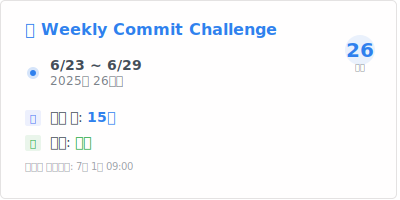
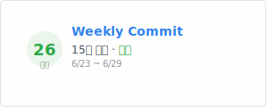
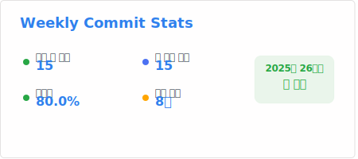
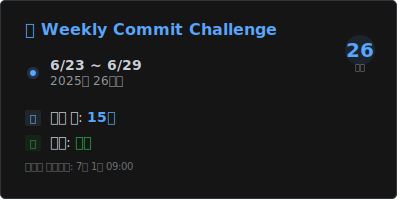

# 🔥 위클리 커밋 챌린지 (Weekly Commit Challenge)

일주일에 한 번은 꼭 커밋하는 습관을 만들어주는 GitHub Actions 기반 챌린지 시스템입니다.

## 🎯 챌린지 소개

- 매주 월요일에 GitHub Actions가 자동으로 실행되어 지난 일주일간 커밋을 확인하고 기록합니다
- 커밋 수와 성공/실패 여부가 README에 테이블 형태로 누적됩니다
- 일주일에 한 번이라도 커밋하면 성공으로 기록됩니다
- 실시간 통계 대시보드에서 누적 참여자, 이번주 성공자, 평균 성공률 등을 확인할 수 있습니다

## 🚀 참여 방법

### 1. 이 레포지토리 Fork 하기
GitHub에서 이 레포지토리를 Fork하여 본인 계정으로 복사하세요.

[](https://github.com/your-username/weekly-commit-challenge/fork)

### 2. GitHub Actions 활성화
Fork한 레포지토리의 Actions 탭에서 워크플로우를 활성화하세요.
> Repository → Actions → "I understand my workflows, go ahead and enable them"

### 3. 일주일에 한 번 커밋하기!
매주 월요일에 지난 일주일간의 커밋을 자동으로 체크합니다. 

## 📊 실시간 랭킹 확인
[챌린지 대시보드](https://your-username.github.io/weekly-commit-challenge/)에서 실시간 랭킹과 통계를 확인할 수 있습니다.

## 🎨 다른 프로젝트에서 사용하기

Weekly Commit Challenge 배지를 다른 프로젝트의 README나 개인 프로필에 임베드할 수 있습니다!

### 📱 배지 & 카드 사용 예시

#### 🏷️ 배지 스타일 (간단)
```markdown

```


#### 📊 카드 스타일 (github-readme-stats 같은 스타일)
```markdown

```

**예시:**

<div align="center">
  
</div>

#### 🎯 컴팩트 카드 (작은 공간용)
```markdown

```

**예시:**

<div align="center">
  
</div>

#### 📈 통계 카드 (상세 정보)
```markdown

```

**예시:**

<div align="center">
  
</div>

### 🔗 링크와 함께 사용
```markdown
[](https://YOUR_USERNAME.github.io/weekly-commit-challange/)
```

### 💡 사용 시나리오
- **개인 GitHub 프로필**: 꾸준한 개발 습관을 어필
- **프로젝트 README**: 지속적인 개발 상태를 보여줌  
- **팀 대시보드**: 팀원들의 커밋 현황을 한눈에 확인
- **이력서/포트폴리오**: 꾸준함을 증명하는 지표

### 🌈 테마 옵션

#### 🌙 다크 테마
```markdown

```

**예시:**

<div align="center">
  
</div>

#### 🎨 사용 가능한 테마들
```markdown
<!-- 기본 밝은 테마 -->


<!-- 다크 테마 -->


<!-- 라디칼 테마 (핑크/청록) -->


<!-- 그럽박스 테마 (노란/베이지) -->


<!-- 도쿄나이트 테마 (보라/파랑) -->

```

### 📋 템플릿 제공
- [개인 프로필 템플릿](./templates/personal-profile-template.md) - GitHub Stats와 조합
- [프로젝트 README 템플릿](./templates/project-readme-template.md) - 컴팩트 카드 활용  
- [팀 대시보드 템플릿](./templates/team-dashboard-template.md) - 팀원별 카드 표시

### 🚀 실제 사용 예시

#### GitHub 프로필에서의 활용
```markdown
<div align="center">
  
  
</div>
```

#### 프로젝트 README 헤더
```markdown
# 🚀 My Awesome Project


프로젝트 설명...
```

#### 팀 대시보드
```markdown
| 멤버 | 주간 상태 |
|------|-----------|
| John |  |
| Jane |  |
```

### 📖 상세 가이드
- [카드 사용법 가이드](./docs/card-usage-examples.md) - github-readme-stats 스타일 활용법
- [임베드 가이드](./docs/embed-examples.md) - 기본 사용법
- [빠른 시작 가이드](./docs/quick-start.md) - 5분만에 시작하기

## 🏆 챌린지 규칙

- **성공 조건**: 일주일에 1개 이상의 커밋
- **기록 방식**: README에 기간, 주차, 커밋 수, 성공 여부가 테이블로 기록됩니다
- **연속 기록**: 주차별로 연속 성공/실패 기록을 추적할 수 있습니다
- **자동 업데이트**: GitHub Actions가 자동으로 실행되어 README 업데이트 (이 커밋은 다음 주 성공 여부에 영향 없음)

## 📈 기록 예시

참여하면 README에 다음과 같은 테이블이 자동으로 생성됩니다:

| 기간 | 주차 | 커밋 수 | 성공 여부 |
| --- | --- | --- | --- |
| 2024-01-01 ~ 2024-01-07 | 1주차 | 5 | ✅ 성공 |
| 2024-01-08 ~ 2024-01-14 | 2주차 | 3 | ✅ 성공 |
| 2024-01-15 ~ 2024-01-21 | 3주차 | 0 | ❌ 실패 |
| 2024-01-22 ~ 2024-01-28 | 4주차 | 7 | ✅ 성공 |

## 📝 주의사항

- 매주 월요일 한국 시간 기준 자정(00:00)에 체크됩니다
- Fork한 레포지토리의 커밋만 체크됩니다
- 일주일 중 언제 커밋해도 상관없습니다
- GitHub Actions가 자동으로 실행되어 README를 업데이트합니다

## 🛠️ 기술 스택

- **Frontend**: HTML, CSS, JavaScript (GitHub Pages 호스팅)
- **Automation**: GitHub Actions
- **Backend**: 외부 API 서버 (별도 구현 필요)

## 📄 라이선스

이 프로젝트는 MIT 라이선스 하에 공개되어 있습니다.